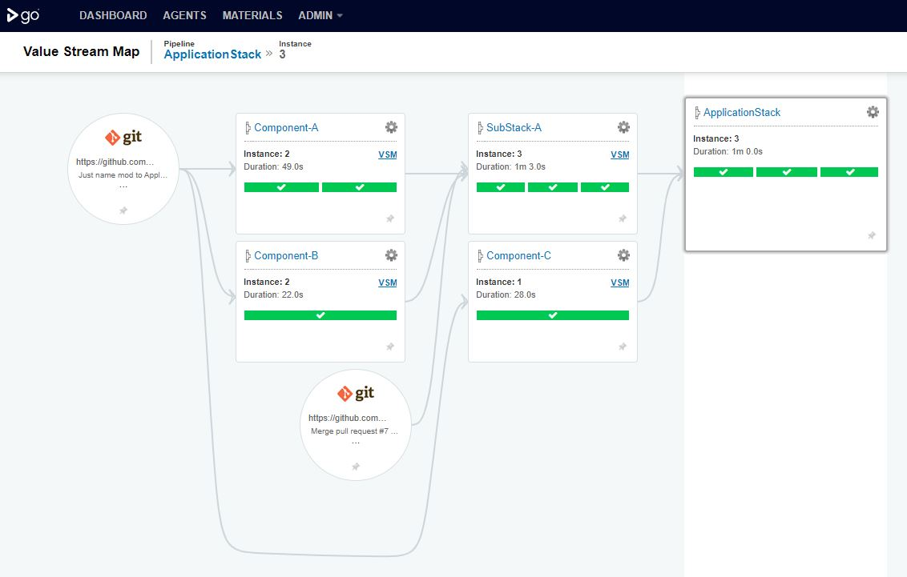

# GoCD demo
This repositry include www.gocd.org demo that setup is as a sandbox.

# Pipelines Groups
- System Smoke -> Test just does GoCD<=>Docker connection work smoothly
- Components -> Include SW components pipelines
- SubStacks -> Is pipeline of pipeline that include SW components integrations with integration testing
- Applicaion -> Is pipeline of pipeline that include SubStack and Component-C integration to working application with integration testing



# Setup
1. Unix socker privialedges so elastic docker agents could be started: ```chmod 777 /var/run/docker.sock```
1. System write data to ./DATA folder so it need wide access to there: ```chmod -R 777 ./DATA```
1. Start:  ```docker-compose up -d```
1. http://localhost:8153 should answer

# Clean
1. Stop:  ```docker-compose down```
1. Remove Data:  ```rm -Rf ./DATA```
1. Prepare to new round:  ```git checkout ./DATA```